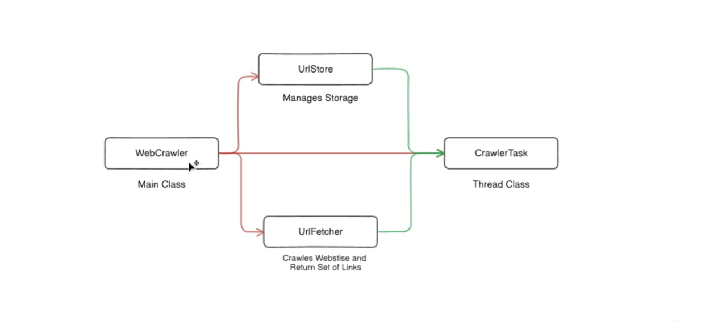
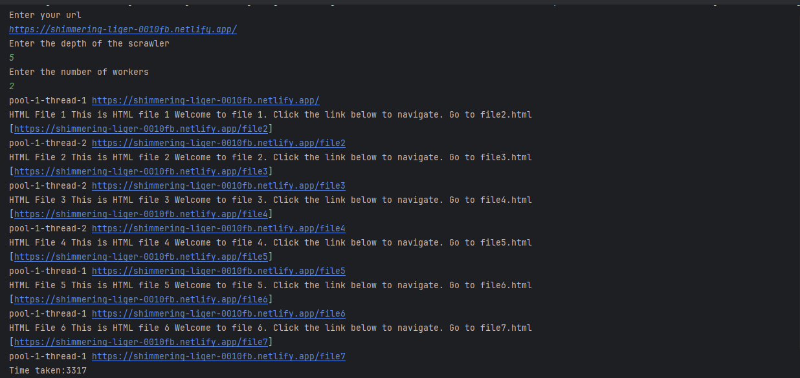

# A Web Crawler

## Purpose

This project is developed to understand the concept of **multithreading** in Java.

## Overview

This is a **multithreaded web crawler** built in Java using **Jsoup** for HTML parsing and **Phaser** for task
synchronization. The crawler fetches links from a given URL up to a specified depth and utilizes a thread pool for
concurrent execution.

## Features

- Uses **Jsoup** to extract hyperlinks from web pages.
- Implements **multi-threading** with an **ExecutorService**.
- Uses **Phaser** for synchronization.
- Keeps track of visited URLs to avoid duplicate processing.

## Architecture Diagram

## How It Works

1. **WebCrawler** prompts the user for a URL, max depth, and number of threads.
2. **URLStore** manages the queue of URLs and prevents duplicate crawling.
3. **URLFetcher** fetches and extracts links using Jsoup.
4. **CrawlerTask** processes URLs concurrently using Phaser for synchronization.

### Example Usage

1. Enter the starting URL.
2. Specify the depth of crawling.
3. Enter the number of worker threads.
4. The program will fetch links recursively up to the given depth.

## Sample Output

## Contributing

Feel free to fork this repository and submit pull requests with improvements.

